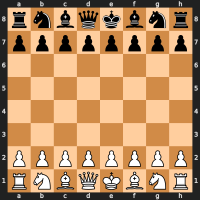

# chess-transformer

<div align="center">


<sub>An en passant capture: legal for exactly one move then gone forever; three moves into the game. Not scripted, sampled from the model's own play.</sub>
</div>

<p align="center">
  <!-- <a href="https://github.com/JOTELLECHEA/chess-transformer/releases"></a> -->
  <a href="LICENSE"></a>
  
</p>
A GPT-style transformer trained to predict chess moves from UCI-tokenized move sequences and, more specifically, a controlled investigation into why such models produce illegal moves, and what actually fixes it.

## Try the tokenizer

Unlike a BPE tokenizer, this one has no fallback for text that isn't a legal
move. It simply can't encode it. 

**[Try it live →](https://jonathantellechea.com/chess-transformer/)** Type a move sequence to watch it tokenize in real time, or type `aaaa` to see
what happens.

## Results

Checkpoint names encode corpus size and architecture: `1.2m_L12E384H6` is 1.2M
games, 12 layers, 384 embedding dimensions, 6 attention heads.

| Checkpoint | Architecture | Epochs | Final Val Loss | Legal-move rate | Fully-legal games |
|:---|:---:|:---:|:---:|:---:|:---:|
| `98k_L6E256H4` | 6L / 256E / 4H | 5 | 2.2593 | 97.3% | 4.4% (n=500) |
| `1.2m_L6E256H4` | 6L / 256E / 4H | 5 | 2.1035 | 97.7% | 11.4% (n=500) |
| `98k_L12E384H6` | 12L / 384E / 6H | 5 | 2.7826 | 97.8% | 9.8% (n=500) |
| **`1.2m_L12E384H6`** | **12L / 384E / 6H** | **5** | **1.7015** | **99.1%** | **51.8% (n=500)** |

Scaling data alone takes fully-legal games from 4.4% to 11.4%. Scaling capacity
alone takes it to 9.8%. Doing both takes it to 51.8%, roughly 12x baseline and
five times what either intervention achieves on its own. Capacity and data
unlock each other rather than contributing separable gains.

Linear probes show why: the 12-layer model's internal board-state
representation peaks at layer 9 of 12, closing 84.6% of the gap to perfect
against a random-init baseline, while the 6-layer model plateaus short of it.

Legality is not strength, though. Against Stockfish, only one win-rate
difference across the whole skill range is statistically significant.

See [`RESULTS.md`](RESULTS.md) for the full breakdown, including a rejected
hypothesis about game length and the known limitations.

## Watch it play

<div align="center">

</div>

The flagship checkpoint (`1.2m_L12E384H6`) playing Stockfish as White at
temperature `0.1`, low enough to reflect the model's own confident preference
rather than a lucky sample. A full 79-ply game ending in a win.


## Data

This project trains on data from the [Lichess open database](https://database.lichess.org),
released under [CC0](https://creativecommons.org/publicdomain/zero/1.0/). Games were kept
if at least one player was GM-titled, across all time controls except correspondence, then
converted from SAN to UCI notation.

`vocab_fixed.json` is the canonical, closed-form move vocabulary. Every theoretically possible UCI move plus five special tokens, computed once from the rules of chess.


## Motivation

This project began as a straightforward tokenizer-and-training exercise, extending prior character-level language modeling work into the chess domain. As the project evolved, understanding the tradeoffs between chess notations became central to the design: SAN (`Nf3`) requires disambiguation whenever multiple pieces of the same type could legally reach the same square, while UCI (`g1f3`) is purely a from-square/to-square encoding with no explicit piece-identity information at all.

Tokenization mattered more than expected. Character-level was the obvious default, but word-level made more sense: each token is a full UCI move, which avoids splitting one move into several unrelated character predictions. The tradeoff is that the model must infer which piece is moving from history alone. That's what makes "does it track board state internally" a real question rather than something handed to it for free.

## Reproducing this work

Two system dependencies aren't covered by pip:

```bash
apt install stockfish   # playing games against the model
apt install wget        # resumable archive downloads
```

**1. Clone and install**

```bash
git clone https://github.com/JOTELLECHEA/chess-transformer.git
cd chess-transformer
pip install -r requirements.txt
```

**2. Download the Lichess archives**

The two corpora in the results table:

```bash
# 98k corpus: a single month, ~30GB
python -m src.download_lichess_data --corpus 98k --output-dir data

# 1.2m corpus: 18 months, ~510GB
python -m src.download_lichess_data --corpus 1.2m --output-dir data
```

Roughly 30GB compressed per month, so the full pull is around 510GB. Downloads
are resumable and checksum-verified, so an interrupted run can be restarted
with the same command.

**3. Tokenize**

```bash
python -m src.tokenise_lichess_batch \
    --input-dir data \
    --output chessDataset_1.2m.txt \
    --checkpoint-file batch_progress.json
```

The GM filter is aggressive: 510GB of archives reduces to a 500MB token file
of roughly 1.2M games. Resumable, so an interrupted run can be restarted with
the same command. Delete `batch_progress.json` once it finishes.

**4. Build the vocabulary (optional)**

```bash
python -m src.build_vocab --closed-form --output vocab_fixed.json
```

`vocab_fixed.json` ships with the repo. The vocabulary is closed-form, so
rebuilding it produces an identical file.

**5. Train**

Edit `src/config.py` to set architecture and training parameters, then:

```bash
python train.py
```

Defaults to `chessDataset_1.2m.txt`.

**6. Evaluate legality**

```bash
python -m src.eval_legality --checkpoint-dir checkpoints/<checkpoint_name> --n-games 50
```

See `src/README.md` for the full pipeline breakdown and script-by-script
documentation.


## Training infrastructure

Most of this project trained locally on an RTX 5060 TI OC (16GB). The flagship
checkpoint's full 5-epoch run needed more sustained compute than was practical
locally, so it ran on a rented A100 via Google Colab.

Colab is unreliable over multi-hour runs: idle timeouts, background-execution
limits, and occasional silent VM-level clock jumps all showed up here.
`train.py` handles this rather than assuming a clean session. Checkpoints write
atomically, via a temp file plus a rename, so an interruption mid-write can't
corrupt a checkpoint already on disk, and elapsed training time survives a
resume without resetting. Both were validated against real interruptions during
development.

## Related work

This project replicates and extends an established line of interpretability research, rather than introducing a novel finding of its own:

- Li, Wu, Nathan, Andreas, Belinkov, Bau — [Emergent World Representations](https://arxiv.org/abs/2210.13382) (OthelloGPT, ICLR 2023) — the foundational demonstration that a transformer trained purely on next-move prediction, with no explicit rules or board supervision, develops an internal board-state representation.
- Nanda, Lee, Wattenberg — [Emergent Linear Representations in World Models of Self-Supervised Sequence Models](https://arxiv.org/abs/2309.00941) — showed the OthelloGPT representation is *linearly* decodable, and causally used by the model, not just incidentally present.
- Karvonen — [Emergent World Models and Latent Variable Estimation in Chess-Playing Language Models](https://arxiv.org/abs/2403.15498) (COLM 2024) — extends the same methodology to chess specifically.

## Roadmap

- **A phrase-aware tokenization variant** — the existing closed-form move vocabulary (every theoretically possible move, including all four promotion types) would remain unchanged as the base layer. A second, learned layer on top would merge frequently-repeated *opening* sequences into single phrase-tokens, with which sequences qualify determined by real corpus frequency rather than a fixed, hand-curated opening-book lookup. Tested head-to-head against the current scheme on legality, training efficiency, and probe accuracy.
- **Castling and en passant probing** — extending the linear-probe methodology to test whether the model's internal representation tracks history-dependent legality (castling rights, en passant availability), not just current piece positions.
- **Color-balance check** — every win-rate/illegal-rate result above had the model playing White exclusively, an uncontrolled variable given chess's real structural color asymmetries. `plot_win_rate_by_color.py` exists and is tested (including direct verification that a result string is correctly attributed to the model regardless of which side it's playing), but hasn't yet been run at scale on the real checkpoints.


## Authors & License

- **Author:** Jonathan Tellechea
- **License:** MIT License (see the [LICENSE](LICENSE) file for details)
