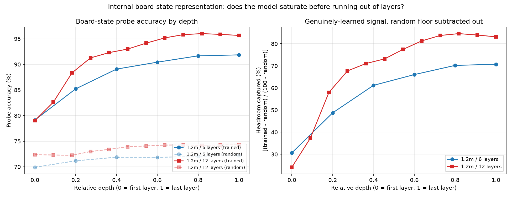
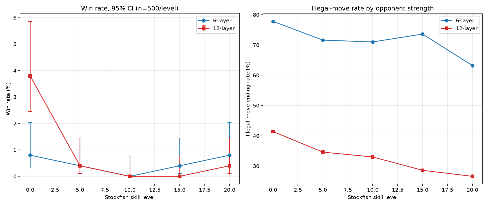

# Results

Full breakdown of the findings summarized in the [README](README.md).

Checkpoint names encode corpus size and architecture: `1.2m_L12E384H6` is 1.2M
games, 12 layers, 384 embedding dimensions, 6 attention heads.

| Checkpoint | Architecture | Epochs | Final Val Loss | Legal-move rate | Fully-legal games |
|:---:|:---:|:---:|:---:|:---:|:---:|
| `98k_L6E256H4` | 6L / 256E / 4H | 5 | 2.2593 | 97.3% | 4.4% (n=500) |
| `1.2m_L6E256H4` | 6L / 256E / 4H | 5 | 2.1035 | 97.7% | 11.4% (n=500) |
| `98k_L12E384H6` | 12L / 384E / 6H | 5 | 2.7826 | 97.8% | 9.8% (n=500) |
| **`1.2m_L12E384H6`** | **12L / 384E / 6H** | **5** | **1.7015** | **99.1%** | **51.8% (n=500)** |

## Data and capacity are synergistic

Neither more data nor more capacity alone explains the full effect. Data alone takes fully-legal games from 4.4% to 11.4% (2.6x); capacity alone reaches 9.8% (2.2x). Combined, the result is 51.8% — roughly 12x baseline, and 4.5-5.3x what either intervention achieves on its own. The effect is synergistic rather than additive: capacity and data unlock each other rather than contributing separable gains.

## Linear probes

Following the methodology of Li et al.'s OthelloGPT work and its chess-specific
extensions, linear probes test whether the model's internal activations encode
true board state. These were rerun on the closed-form-vocab checkpoints in the
table above, with a trained-vs-random-init baseline.

The 6-layer architecture's probe accuracy is still climbing at its final layer, but with sharply diminishing returns: layer-over-layer improvement collapses from +18 points early on to +0.5 points by the last layer. This is consistent with approaching a ceiling, though distinguishing "would plateau given more layers" from "would keep climbing" would require training a deeper variant of the same architecture.

The 12-layer architecture peaks at layer 9 of 12, at 84.6% of the theoretical
gap to perfect measured against a random-init baseline, then declines through
its final two layers. The model has spare representational capacity and
repurposes some of it away from board-state legibility as it approaches the
output. This accounts for why the capacity intervention worked, not just that
it did.

## Does more training help, once capacity is sufficient?

Within the flagship checkpoint's training run, validation loss improved every
epoch, from `1.7337` after epoch 1 to `1.7015` after epoch 5, with no
overfitting turnaround at any point. The model kept learning well past a single
epoch.

## Win rate against Stockfish

Every legality number above measures whether moves are *valid*, a separate
question from whether they're *good*. To test playing strength, both
architectures played Stockfish across a range of skill levels (`n=500` games
per point).

**Only one win-rate difference in this grid is statistically significant.** At
skill 0, the 12-layer model wins more often than the 6-layer (`3.8%` vs `0.8%`,
non-overlapping 95% CIs). Every other difference falls within noise at `n=500`
per point.

The illegal-move-ending rate tells a separate story: it decreases smoothly and
consistently as Stockfish gets stronger, for both architectures. A plausible
explanation is that stronger play produces shorter games and therefore fewer
opportunities for an eventual illegal move. This is testable but not yet
directly confirmed.

## Rejected: the resignation-boundary hypothesis

Do illegal moves happen because generated games run past the point where a real
GM game would have ended in resignation? If training games rarely extend past
move 100-130, the corpus's own 75th-90th percentile, the model might be poorly
equipped for positions beyond that.

Comparing the distribution of first-illegal-move ply against the corpus's game length distribution found no support for this, across four independent conditions. Median illegal-move onset was ply 50 at skill 0 and ply 37 at skill 20, both well before the corpus's 75th percentile of 105 plies, let alone its 90th at 128. The same pattern holds at temperature 0.1, and on the 6-layer architecture — which, despite failing far more often (n=159 illegal-move events in a single run, the largest sample collected here), showed onset concentrated almost entirely between ply 10 and 70.

The shift between skill 0 and skill 20 moves in the same direction as games getting shorter against stronger play, consistent with the simpler "fewer moves played, fewer chances to fail" explanation. Having now been checked across opponent strength, sampling temperature, and architecture, the rejection does not appear to be an artifact of any one setting.

## Limitations

**The data arm varies time period alongside scale.** The 98k corpus is drawn
from 2023-01, while the additional data in the 1.2m corpus comes from 2025-01
through 2026-05. Lichess's player population and rating distribution shift over
a three-year gap, so the data comparison is not a clean scale-only
manipulation. The capacity comparison is unaffected, holding corpus fixed
within each pair. A same-period control at 98k scale would isolate this.

**Color is uncontrolled.** Every win-rate and illegal-rate result here had the
model playing White exclusively.

**Legality evaluation is self-play generation, not tournament play.** The
fully-legal-game percentages measure unconditioned generation, which is a
different distribution from the positions reached against Stockfish.
